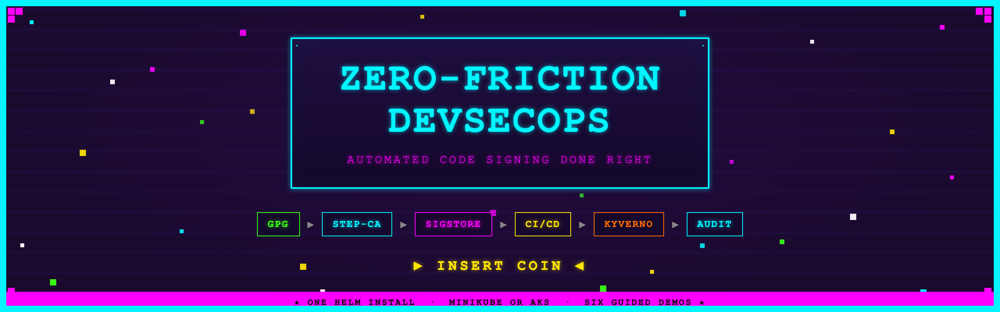

<p align="center">
  
</p>

# DevSecOps Code Signing Demo

**Talk:** "Zero-Friction DevSecOps: Automated Code Signing Done Right"
**Presented at:** BSides Melbourne 2026 · AppSec Australia (Melbourne #19) · KCD Melbourne 2026

A complete, self-contained demonstration environment that deploys a full code-signing stack
via a single `helm install`. Covers Smallstep CA signing, Sigstore keyless signing, Docker
Registry v2, and Kyverno policy enforcement — running on a **local minikube cluster** or
on **Azure Kubernetes Service** (provisioned end-to-end via Terraform). All six demo
scripts auto-detect the target and behave identically.

The slides for the talk live in
[`jamesbannan/presentations`](https://github.com/jamesbannan/presentations). They are
built from [`.presentation/facts.yaml`](.presentation/README.md) in this repository, so
the deck tracks the demos rather than restating them.

---

## Quickstart — Local minikube (~20 minutes)

For an end-to-end **Azure AKS** deployment, see [Cloud Deployment](#cloud-deployment) below.

### Prerequisites

| Tool | Version | Install |
|------|---------|---------|
| minikube | 1.32+ | https://minikube.sigs.k8s.io/docs/start/ |
| Docker Desktop or Podman Desktop | — | https://www.docker.com/products/docker-desktop/ or https://podman-desktop.io/ |
| Helm | 3.14+ | https://helm.sh/docs/intro/install/ |
| kubectl | 1.29+ | https://kubernetes.io/docs/tasks/tools/ |
| cosign | 2.2.4+ | `brew install cosign` |
| step | 0.25+ | https://smallstep.com/docs/step-cli/installation/ |
| python3 | 3.8+ | Usually pre-installed on macOS/Linux |
| GnuPG | 2.x | `brew install gnupg` (required for Demo 1 only) |
| curl | — | Usually pre-installed |

> **Note:** On macOS with Docker Desktop, the Docker daemon runs inside a VM and cannot
> reach `localhost` port-forwards on the host. The build-and-push script and demo scripts
> automatically use `minikube image build` as the preferred build tool to avoid this
> limitation. In-cluster workloads are unaffected.

### Step 1 — Start the cluster

```bash
bash scripts/start-minikube.sh
```

This starts minikube with the Podman driver, containerd runtime, and the OIDC issuer
configuration required for Fulcio keyless signing. Takes ~2 minutes.

### Step 2 — Install the demo environment

```bash
bash scripts/install.sh
```

This runs `helm dependency update`, installs the umbrella chart, waits for core
infrastructure Deployments and StatefulSets to become ready, launches port-forwards,
and initialises the cosign TUF root. Takes ~10–15 minutes for all pods to become ready
(Trillian MySQL is the slowest component on Apple Silicon).

> The install uses a manual readiness check loop rather than `helm --wait` because
> demo workload Jobs are expected to remain incomplete until the demo image is built
> via `build-and-push.sh`.

### Step 3 — Verify everything is healthy

```bash
bash scripts/verify.sh
```

Runs 18 checks covering infrastructure health, Sigstore components, step-ca PKI,
registry connectivity, Kyverno policy, and end-to-end signing round-trips.
All should show `[PASS]` or `[WARN]`. Any `[FAIL]` — check `docs/troubleshooting.md`.

Checks 15, 16, and 18 will show `[WARN]` until you run `build-and-push.sh` and the
signing jobs complete.

### Step 4 — Build and push the demo app

```bash
bash demos/demo-app/build-and-push.sh
```

Builds the Go demo application and pushes it to the local registry at `localhost:30500`
(or your ACR on AKS). **Required** before running demos 2, 3, and 6 (those demos sign or
inspect the pre-existing `demo/app:latest` image). Demo 4 builds the image itself as
part of the pipeline simulation; Demos 1 and 5 don't need it. See
[`demos/README.md`](demos/README.md#per-demo-image-prerequisites) for the full matrix.

> **Presentation web UIs.** For a live talk you can browse the registry
> and the Rekor transparency log in a browser (`localhost:30800` / `localhost:30900`).
> Both are enabled by default and reached via the port-forwards from Step 2.
> `install.sh` builds and pushes the custom Rekor UI image for you; re-run
> `bash demos/rekor-ui/build-and-push.sh` only to rebuild it (e.g. after bumping
> `REKOR_UI_REF`). See [`demos/rekor-ui/README.md`](demos/rekor-ui/README.md).

### Step 5 — Run the demos

```bash
bash demos/demo1-before/run.sh      # ~5 min — the painful baseline (GPG)
bash demos/demo2-smallstep/run.sh   # ~4 min — Smallstep CA signing (incl. 2-min cert expiry wait)
bash demos/demo3-sigstore/run.sh    # ~5 min — Sigstore keyless signing
bash demos/demo4-cicd/run.sh        # ~5 min — CI/CD pipeline simulation
bash demos/demo5-verification/run.sh # ~5 min — Kyverno policy enforcement
bash demos/demo6-audit/run.sh       # ~5 min — Attestations + CISO audit trail
```

See `demos/README.md` for presenter tips and environment variable overrides.

---

## Architecture

```
  Host                      Kubernetes Cluster (minikube)
  ────                      ──────────────────────────────
  cosign ──── port-forward ─→ Rekor        (transparency log)
  step   ──── port-forward ─→ Fulcio       (CA for keyless)
  docker ──── port-forward ─→ Registry v2  (image store)
                             → TUF          (trust root mirror)
                             → step-ca      (private PKI)
                             → Kyverno      (policy enforcement)
                             → demo-app     (workload)
```

**Port-forward endpoints** (started automatically by `install.sh`):

| Service | Host URL | In-cluster DNS |
|---------|----------|----------------|
| Docker Registry | `localhost:30500` | `registry.registry.svc:5000` |
| Rekor | `http://localhost:30300` | `rekor-server.rekor-system.svc:80` |
| Fulcio | `http://localhost:30200` | `fulcio-server.fulcio-system.svc:80` |
| TUF mirror | `http://localhost:30100` | `tuf-server.tuf-system.svc:80` |
| step-ca | `https://localhost:39000` | `devsecops-demo-stepca.pki.svc:9000` |
| Registry UI 🖥️ | `http://localhost:30800` | `registry-ui.registry.svc:80` |
| Rekor Search UI 🖥️ | `http://localhost:30900` | `rekor-ui.registry.svc:8080` |

🖥️ **Presentation web UIs** — a registry browser ([joxit/docker-registry-ui](https://github.com/Joxit/docker-registry-ui))
and the [Sigstore Rekor Search UI](https://github.com/sigstore/rekor-search-ui), wired into the chart for
live demos (enable/disable via `registryUi.enabled` / `rekorUi.enabled`). `install.sh` builds and pushes the
custom Rekor UI image automatically; re-run `bash demos/rekor-ui/build-and-push.sh` only to rebuild it.
See [`demos/rekor-ui/README.md`](demos/rekor-ui/README.md).

Full ASCII diagram and component descriptions: [`docs/architecture.md`](docs/architecture.md)

Two signing paths:
- **Smallstep CA** — private PKI, 2-minute code signing certs, Rekor transparency log, no external dependencies
- **Sigstore keyless** — public transparency log, OIDC identity, no long-lived keys

---

## Demo Flow

### Demo 1 — GPG Baseline (`demo1-before/run.sh`)
Shows the traditional approach: generate a GPG key, manually sign an artifact, verify
the signature. Highlights the pain points — long-lived keys, manual key management,
no expiry, no audit trail.

### Demo 2 — Smallstep CA Signing (`demo2-smallstep/run.sh`)
Issues a **2-minute code signing certificate** from the private Smallstep CA, signs
the container image with cosign, waits for the cert to expire, then verifies the
signature **still passes** — because the Rekor transparency log recorded the exact
signing timestamp. Key concepts demonstrated:
- Code Signing EKU restricts certificate usage
- Short-lived certs limit blast radius vs long-lived GPG keys
- Transparency log provides non-repudiation and temporal proof

### Demo 3 — Sigstore Keyless Signing (`demo3-sigstore/run.sh`)
Performs **keyless signing** from the host using Fulcio and Rekor — no keys exist
anywhere, not even temporarily on disk. The OIDC token from the Kubernetes
ServiceAccount is the only identity credential. Steps demonstrated:
- Decode the JWT token to show issuer, subject, audience
- `cosign sign` with `--fulcio-url` and `--rekor-url` (ephemeral key pair in memory)
- Extract the Fulcio-issued certificate from the signature (URI SAN identity)
- Verify with explicit `--certificate-identity` and `--certificate-oidc-issuer`
- Query the Rekor API directly to show the raw transparency log entry

### Demo 4 — CI/CD Pipeline Simulation (`demo4-cicd/run.sh`)
Simulates a **GitHub Actions workflow** locally with CI-style step output.
Runs the full pipeline: BUILD → PUSH → SIGN (both paths) → VERIFY → DEPLOY.
Both Smallstep and Sigstore keyless signing are performed from the host.
The final step deploys a signed image to the workload namespace — Kyverno
admits it (in Audit mode) and the pod runs successfully.

### Demo 5 — Kyverno Policy Enforcement (`demo5-verification/run.sh`)
Switches Kyverno from **Audit to Enforce mode** and demonstrates the policy gate.
First configures the ClusterPolicy with the local Fulcio root certificate and
Rekor public key, then:
- Deploys an **unsigned** image → **BLOCKED** by Kyverno's admission webhook
- Deploys a **signed** image → **ADMITTED** and running

Key configuration applied at runtime:
- Fulcio root cert for local CA chain verification
- Rekor public key for local transparency log verification
- `ignoreSCT: true` (local Fulcio has no public CT log)
- `mutateDigest: true` in Enforce mode (resolves tags to digests)

The policy is restored to Audit mode on exit (including on Ctrl-C).

### Demo 6 — Attestation + Audit Trail (`demo6-audit/run.sh`)
Creates and verifies an **in-toto SLSA provenance attestation** from the host,
then assembles the full audit picture for a CISO audience. Steps demonstrated:
- Build a provenance predicate (builder, source repo, git SHA, build time)
- `cosign attest` with keyless signing via Fulcio + Rekor (attestation logged in tlog)
- `cosign tree` shows signatures and attestations stored alongside the image
- `cosign verify-attestation` confirms the provenance is cryptographically bound
- Kyverno PolicyReports provide machine-readable admission audit logs
- Full provenance chain: source → build → image → signature → tlog → policy
- Formatted CISO report with identity, compliance status, and transparency log size

---

## Code Signing Configuration

The Smallstep CA is configured via a post-install Helm hook
(`chart/templates/pki/stepca-codesigning-config.yaml`) that patches the CA's
provisioner configuration to:

1. Add an **x509 template** with `codeSigning` extended key usage (required by cosign v3)
2. Set `minTLSCertDuration: 30s` to allow short-lived demo certificates
3. Set `defaultTLSCertDuration: 5m` for workload signing jobs

The in-cluster signing job (`signing-job-smallstep`) uses the **JWK provisioner**
(`workload-signer`) with a provisioner password stored as a Kubernetes Secret.
Signatures are uploaded to the local Rekor transparency log, enabling verification
even after the signing certificate has expired.

### Kyverno Policy Configuration

The `require-image-signature` ClusterPolicy verifies cosign signatures on images
deployed to the workload namespace. For Enforce mode to work with a local Sigstore
stack, the policy requires:

- **Fulcio root certificate** (`roots`) — the local Fulcio CA cert, sourced from the
  `fulcio-pub-key` Secret in `fulcio-system`
- **Rekor public key** (`rekor.pubkey`) — the local Rekor signing key, sourced from the
  `rekor-public-key` Secret in `tuf-system`
- **`ctlog.ignoreSCT: true`** — local Fulcio doesn't submit to a public CT log
- **`allowInsecureRegistry: true`** — the local registry is HTTP-only

The policy's `subject` field matches the Fulcio certificate **URI SAN** format
(`https://kubernetes.io/namespaces/workload/serviceaccounts/signing-sa`), not the
OIDC `sub` claim (`system:serviceaccount:workload:signing-sa`).

Demo 5 applies these settings at runtime. In a production deployment, they would be
baked into the Helm chart values.

---

## Cleanup

```bash
bash scripts/reset-demo.sh   # Soft reset: wipe workload Jobs/pods + redeploy (core PKI stays up)
bash scripts/uninstall.sh    # Interactive: Helm uninstall + optional namespace/cluster deletion
bash scripts/cleanup.sh      # Non-interactive forceful reset (cluster stays up)
```

`reset-demo.sh` is the fastest way to re-run the demos from scratch: it deletes
the Jobs and pods in the `workload` namespace and re-runs `helm upgrade` to
redeploy them, while leaving the core PKI (step-ca, Fulcio, Rekor, TUF, Trillian,
ctlog, registry, Kyverno) untouched. It also resets the Kyverno
`require-image-signature` ClusterPolicy back to chart defaults (`Audit`,
`mutateDigest: false`) — Demo 5 patches those at runtime, so the soft reset uses
`helm upgrade --force-conflicts` to reclaim ownership from the `kubectl-patch`
field manager (required under Helm 4's server-side apply). Because the
`helm upgrade` re-fires the step-ca config hook (which restarts step-ca and would
otherwise drop the `localhost:39000` port-forward), `reset-demo.sh` re-establishes
the port-forwards automatically afterwards. Supports `FORCE=true` (skip prompt),
`--purge-images`, and `--no-redeploy`.

`cleanup.sh` is the right choice when a `helm uninstall` got stuck (orphan
Kyverno webhooks, terminating namespaces, PVCs with finalizers) and you just
want to re-run `install.sh` without paying the AKS cluster creation cost again.
Supports `FORCE=true` (skip prompt) and `PURGE_CRDS=true` (also drop demo CRDs).

### After the demo laptop has slept

`kubectl port-forward` processes survive sleep but their TCP connections don't —
endpoints will appear to listen and then immediately reset. Run:

```bash
bash scripts/resume.sh
```

This kills any dead port-forwards (recorded **and** orphaned), re-fetches AKS
credentials if the token has expired (or restarts minikube if it stopped),
restarts the forwards, and probes each endpoint with curl to confirm the
environment is healthy before you start the next demo.

---

## Cloud Deployment

### Azure AKS — provisioned end-to-end

The repository ships a Terraform stack and bootstrap scripts that provision a
dev/test AKS cluster + Azure Container Registry in **australiaeast** (configurable),
then deploy the same Helm chart and run the same demo scripts unchanged.

**Additional prerequisites**

| Tool | Version | Install |
|------|---------|---------|
| Terraform | 1.5+ | `tfenv install 1.15.3 && tfenv use 1.15.3` (or any 1.5+) |
| Azure CLI | 2.60+ | `brew install azure-cli` |

**Quickstart**

```bash
az login                                 # authenticate
az account set --subscription <name|id>  # select target subscription

bash scripts/aks-up.sh                   # terraform apply + render values-aks.local.yaml (~10 min)
bash scripts/install.sh                  # auto-picks chart/values-aks.local.yaml
bash demos/demo-app/build-and-push.sh    # builds + az acr login + docker push
bash demos/rekor-ui/build-and-push.sh    # only to rebuild the web UI (install.sh attempts this automatically)
bash demos/demo1-before/run.sh           # ... run any demo; scripts auto-detect AKS
bash scripts/aks-down.sh                 # tear everything down (~5 min)
```

`scripts/aks-up.sh` provisions an `azurerm_resource_group`, `azurerm_container_registry`,
`azurerm_user_assigned_identity`, and `azurerm_kubernetes_cluster` (workload-identity +
OIDC enabled). It uses a **local** Terraform state file under `infra/aks/` (gitignored).

The bootstrap renders `chart/values-aks.local.yaml` from the committed
`chart/values-aks.yaml` template, substituting the live ACR login server and AKS
OIDC issuer URL so Fulcio accepts ServiceAccount tokens from the AKS-managed issuer.

See `infra/aks/README.md` for Terraform variable reference (region, VM SKU,
Kubernetes version) and operator notes.

### Other clouds (manual)

The chart also ships untested values overrides for EKS and GKE:

```bash
# AWS EKS
helm upgrade --install devsecops-demo chart/ \
  -f chart/values-eks.yaml \
  --set global.registry=123456789.dkr.ecr.ap-southeast-2.amazonaws.com \
  --wait --timeout 15m

# GCP GKE
helm upgrade --install devsecops-demo chart/ \
  -f chart/values-gke.yaml \
  --set global.registry=australia-southeast1-docker.pkg.dev/myproject/demo \
  --wait --timeout 15m
```

See the cloud values files for prerequisites (OIDC issuer configuration, registry auth, storage class).

---

## Repository Structure

```
devsecops-demo/
├── chart/                    ← Umbrella Helm chart
│   ├── Chart.yaml            ← Dependencies: scaffold + kyverno + step-certificates
│   ├── values.yaml           ← Local/minikube defaults
│   ├── values-aks.yaml       ← Azure overrides (template; values-aks.local.yaml is rendered)
│   ├── values-eks.yaml       ← AWS overrides (untested)
│   ├── values-gke.yaml       ← GCP overrides (untested)
│   └── templates/
│       ├── namespaces.yaml
│       ├── pki/              ← CA root propagation, TUF secret copy, code signing config
│       ├── registry/         ← Docker Registry v2
│       ├── registry-ui/      ← Registry browser UI (joxit) — presentation extra
│       ├── rekor-ui/         ← Rekor Search UI — presentation extra
│       ├── workload/         ← Signing jobs + verification + demo app
│       └── policy/           ← Kyverno ClusterPolicies
├── infra/
│   └── aks/                  ← Terraform stack for dev/test AKS + ACR + UAMI
├── scripts/
│   ├── start-minikube.sh     ← minikube bootstrap
│   ├── aks-up.sh             ← AKS bootstrap: terraform apply + kubeconfig + values render
│   ├── aks-down.sh           ← AKS teardown: helm uninstall + terraform destroy
│   ├── _cluster-detect.sh    ← Sourced helper: exports CLUSTER_KIND, CLUSTER_REGISTRY, etc.
│   ├── install.sh            ← Helm install (auto-picks values-aks.local.yaml on AKS)
│   ├── port-forward.sh
│   ├── resume.sh             ← Re-establish port-forwards after laptop wakes from sleep
│   ├── verify.sh
│   ├── reset-demo.sh         ← Soft reset: wipe workload Jobs/pods + helm redeploy (PKI stays up)
│   ├── cleanup.sh            ← Forceful reset (no cluster teardown; for stuck installs)
│   └── uninstall.sh
├── demos/
│   ├── demo-app/             ← Go HTTP server + Dockerfile + build-and-push.sh
│   ├── rekor-ui/             ← Rekor Search UI image (Next.js export + nginx proxy)
│   ├── demo1-before/         ← Manual GPG signing
│   ├── demo2-smallstep/      ← Smallstep CA path
│   ├── demo3-sigstore/       ← Sigstore keyless path
│   ├── demo4-cicd/           ← CI/CD simulation
│   ├── demo5-verification/   ← Policy enforcement
│   └── demo6-audit/          ← Attestations + audit trail
└── docs/
    ├── architecture.md
    └── troubleshooting.md
```

---

## Verification Checklist

The `scripts/verify.sh` script checks all of the following:

1. All namespaces exist and are Active
2. All Deployments have readyReplicas >= 1
3. step-ca /health returns ok
4. step-ca provisioner list includes workload-signer
5. Registry /v2/ returns {}
6. Registry push/pull round-trip
7. Rekor /api/v1/log returns valid treeSize
8. Rekor public key endpoint returns PEM
9. Fulcio /healthz returns ok
10. Fulcio root cert returns valid PEM
11. TUF root.json is available
12. cosign TUF root is initialised
13. OIDC issuer is appropriate for the cluster (`https://kubernetes.default.svc` on minikube; AKS-managed issuer URL on AKS)
14. Kyverno running + ClusterPolicy exists
15. Smallstep signing round-trip
16. Sigstore keyless signing round-trip
17. Policy gate test
18. Attestation round-trip

---

## Known Issues

| Issue | Impact | Workaround |
|-------|--------|------------|
| **Docker Desktop VM networking** (macOS, minikube only) | `docker push localhost:30500` fails because the daemon runs inside a VM that cannot reach host port-forwards | Scripts auto-detect minikube and use `minikube image build` + `ctr push` via ClusterIP. On AKS, images go straight to ACR. |
| **AVM `ptn-aks-dev` SKU hardcode** | The Azure Verified Module hard-codes `Standard_DS2_v2` and `load_balancer_sku = basic`, both blocked in some subscriptions/regions | `infra/aks/main.tf` inlines an equivalent native resource set and exposes `node_vm_size` (default `Standard_D2s_v5`) and `standard` load-balancer SKU. |
| **Trillian MySQL slow start** (Apple Silicon) | MySQL may take 2–3 minutes to pass readiness probes on ARM64 | `install.sh` allows up to 10 minutes. Probe timeouts are tuned in `values.yaml`. |
| **`trillian-createdb` pods in `Error`** | The scaffold `createdb` Job retries until MySQL is ready, leaving a few failed (`Error`/`Failed`) pods behind — harmless history, but noisy in `kubectl get pods`. | Expected. `install.sh` sweeps terminal `Failed`-phase pods in the infra namespaces once core infrastructure is Ready (the `Cleaning up failed Job pods` step). The successful `Completed` attempt is kept. |
| **Workload Job warnings** | Checks 15/16/18 in `verify.sh` warn until the demo image exists | Run `demos/demo-app/build-and-push.sh` first, then re-run `verify.sh`. |
| **cosign v3 bundle format** | Kyverno v1.15 doesn't fully support cosign v3's OCI referrer-based signatures | Demo5 re-signs with `--new-bundle-format=false` for Kyverno compatibility. |
| **AKS image-arch mismatch** | Building on Apple Silicon defaults to arm64; AKS nodes are amd64 → `exec format error` / CrashLoopBackOff | Scripts on AKS default to `TARGET_PLATFORM=linux/amd64`. Override with `TARGET_PLATFORM=linux/arm64` for arm64 node pools. See troubleshooting A6/A7. |
| **Kyverno + local Sigstore** | ClusterPolicy needs Fulcio root cert, Rekor pubkey, and `ignoreSCT: true` for local infrastructure | Demo5 patches the policy at runtime; values are sourced from cluster Secrets. |

---

## License

MIT — see [LICENSE](LICENSE)
